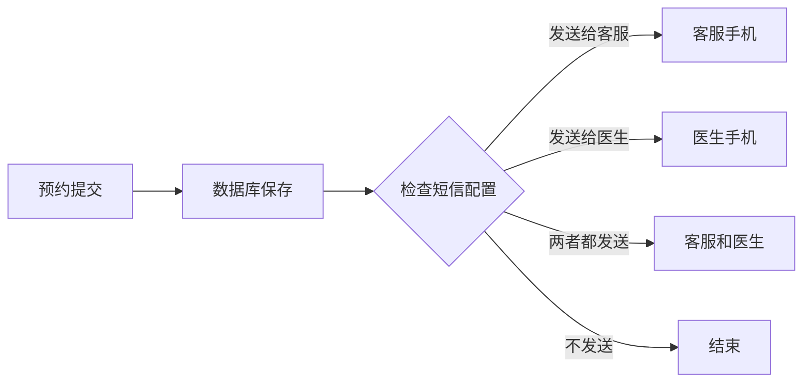

# 知治（广州）健康科技有限公司 - 口腔服务平台需求文档

## 1. 项目概述

### 1.1 项目背景
知治（广州）健康科技有限公司是一家专注于健康医疗服务的科技企业，致力于为用户提供优质的口腔健康服务。本项目旨在开发一个现代化的口腔服务平台，包含企业官网和微信小程序，为用户提供便捷的医生预约服务。

### 1.2 项目目标
- 建立专业的企业形象展示平台
- 提供便捷的口腔医生预约服务
- 支持多地区医生资源浏览和选择
- 实现智能化的预约信息管理
- 提供短信通知功能，提升服务效率

## 2. 功能需求

### 2.1 企业官网功能

#### 2.1.1 首页
- 公司品牌展示和简介
- 核心服务入口（口腔服务、医疗权益卡、细胞服务独立入口）
- 医生资源展示（热门医生推荐）
- 预约入口引导
- 联系方式和地址信息
- 用户评价和案例展示

#### 2.1.2 核心服务页面

##### 口腔服务页面
- 服务分类导航（检查、治疗、美容、修复）
- 详细服务介绍和价格信息
- 服务流程说明和案例展示
- 直接预约特定服务功能
- 在线咨询入口

##### 医疗权益卡页面
- 权益卡类型介绍和对比
- 会员特权详细说明
- 购买流程和价格方案
- 会员案例和评价展示
- 在线购买入口

##### 细胞服务页面
- 细胞存储和治疗服务介绍
- 技术优势和应用领域
- 专家团队和成功案例
- 在线咨询和方案定制
- 服务流程说明

#### 2.1.3 医生资源页面
- 地区选择功能（支持城市/区域筛选）
- 医生列表展示（头像、姓名、职称、专长、评分）
- 医生详情页面（详细介绍、擅长领域、患者评价、服务项目）
- 预约按钮和快速预约功能
- 根据服务类型筛选医生

#### 2.1.4 预约功能
- 多种预约入口（从医生页面、服务页面、首页）
- 智能预约表单（根据服务类型预填信息）
- 日期时间选择器（用户自行输入期望时间）
- 患者信息填写（基本信息、症状描述等）
- 权益卡用户专属预约通道
- 预约确认和提交
- 预约成功页面展示

#### 2.1.5 后台管理
- 医生信息管理（增删改查）
- 服务内容管理（口腔服务、细胞服务）
- 权益卡配置管理
- 预约信息管理
- 咨询工单管理
- 会员数据管理
- 短信通知配置
- 用户数据统计和分析

### 2.2 微信小程序功能

#### 2.2.1 核心功能
- 微信授权登录
- 地区定位和选择
- 核心服务入口（口腔、权益卡、细胞服务）
- 医生浏览和搜索
- 在线预约功能
- 我的预约记录
- 会员权益管理

#### 2.2.2 特色功能
- 预约提醒通知
- 医生评价系统
- 服务进度跟踪
- 在线客服咨询
- 权益卡购买和使用
- 细胞服务在线咨询
- 会员专属特权体验

## 3. 技术架构

### 3.1 前端技术栈
- **React 18** + TypeScript
- **Next.js** 14（服务端渲染）
- **Tailwind CSS**（样式框架）
- **Ant Design** / **MUI**（组件库）
- **微信小程序**原生开发

### 3.2 后端技术栈
- **Node.js** + Express
- **TypeScript**
- **MySQL** / PostgreSQL（数据库）
- **Redis**（缓存和会话管理）
- **JWT**（身份认证）

### 3.3 第三方服务
- **阿里云短信服务**（通知功能）
- **微信开放平台**（小程序相关）
- **地图服务**（地区定位）
- **文件存储服务**（图片等资源）

## 4. 数据库设计

### 4.1 主要数据表

#### doctors 医生表
```sql
id: number (主键)
name: string (姓名)
avatar: string (头像)
title: string (职称)
specialty: string (专长)
hospital: string (所属医院)
location: string (所在地区)
rating: number (评分)
introduction: text (详细介绍)
service_types: JSON COMMENT '提供的服务类型',
created_at: datetime
updated_at: datetime
```

#### appointments 预约表
```sql
id: number (主键)
doctor_id: number (医生ID)
service_type: string COMMENT '服务类型',
patient_name: string (患者姓名)
phone: string (联系电话)
appointment_date: datetime (预约时间)
status: string (状态：待确认/已确认/已完成/已取消)
notes: text (补充信息)
membership_id: number COMMENT '使用的权益卡ID',
created_at: datetime
updated_at: datetime
```

#### sms_config 短信配置表
```sql
id: number (主键)
template_id: string (模板ID)
recipient_type: string (接收人类型：客服/医生)
is_enabled: boolean (是否启用)
created_at: datetime
updated_at: datetime
```

#### service_categories 服务分类表
```sql
id: number (主键)
name: string (分类名称)
type: string (服务类型: dental/cell)
description: text (描述)
icon: string (图标)
sort_order: number (排序)
created_at: datetime
updated_at: datetime
```

#### membership_cards 权益卡表
```sql
id: number (主键)
name: string (权益卡名称)
price: decimal(10,2) (价格)
duration_days: number (有效期天数)
benefits: JSON (权益内容)
description: text (描述)
created_at: datetime
updated_at: datetime
```

## 5. 界面设计规范

### 5.1 色彩体系
- **主色调**: 蓝色系（#1E88E5 - 医疗专业感）
- **辅助色**: 绿色系（#43A047 - 健康活力感）
- **中性色**: 灰色系（#F5F5F5, #9E9E9E）
- **强调色**: 橙色（#FF9800 - 重要操作提示）

### 5.2 设计风格
- 现代简约风格
- 圆角设计元素
- 充足的留白空间
- 清晰的视觉层次
- 响应式布局设计

## 6. 核心业务流程

### 6.1 预约流程
1. 用户选择所在地区
2. 浏览该地区医生列表
3. 选择心仪医生查看详情
4. 点击预约，填写预约信息
5. 提交预约请求
6. 系统保存预约信息到数据库
7. 根据配置发送短信通知
8. 客服/医生处理预约请求

### 6.2 短信通知流程


## 7. 开发阶段规划

### 7.1 第一阶段（2周）
- 项目架构搭建
- 数据库设计实现
- 基础页面开发
- 医生管理功能

### 7.2 第二阶段（3周）
- 预约功能开发
- 地区选择功能
- 短信通知集成
- 后台管理系统

### 7.3 第三阶段（2周）
- 微信小程序开发
- 测试和优化
- 部署上线

## 8. 测试要求

### 8.1 功能测试
- 地区选择功能测试
- 医生浏览和搜索测试
- 预约流程测试
- 短信通知测试

### 8.2 性能测试
- 页面加载速度优化
- 数据库查询性能
- 并发处理能力

### 8.3 兼容性测试
- 主流浏览器兼容
- 移动端适配测试
- 微信小程序兼容性

## 9. 部署要求

### 9.1 生产环境
- Node.js 18+ 运行环境
- MySQL 8.0+ 数据库
- Nginx 反向代理
- SSL证书配置

### 9.2 监控告警
- 应用性能监控
- 错误日志收集
- 短信发送状态监控

## 10. 维护和支持

### 10.1 日常维护
- 定期数据库备份
- 系统日志分析
- 性能优化调整

### 10.2 技术支持
- 7x24小时监控
- 紧急问题响应
- 定期功能更新

---

*本文档版本: v1.0*
*最后更新: 2025-01-20*
*项目负责人: 技术开发团队*